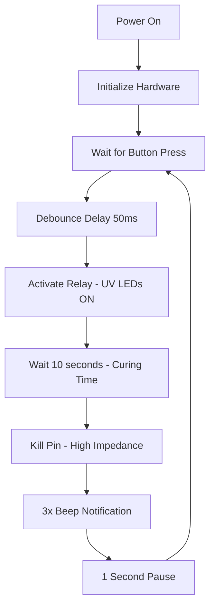

# UV Resin Curing Controller

A Rust embedded application for controlling a UV LED array used in resin 3D printing curing processes. Built for the RP2040 microcontroller (Raspberry Pi Pico/Pico W) using Embassy async framework.

> **✅ Project Status**: Complete and tested! The code compiles cleanly and implements all planned features including the critical "pin kill" relay control technique.

## 🎯 Project Overview

This project controls a UV LED array through a relay module, triggered by a push button with visual and audio feedback. Perfect for post-processing resin 3D prints with precise timing control.

**Key Features:**
- ⏱️ Precise 10-second curing cycles
- 🔘 Simple push-button operation
- 🔵 Visual feedback via onboard LED
- 🔊 Audio completion notification (3-beep sequence)
- 🔄 Automatic relay control with failsafe shutoff
- 🚀 Async/await programming for responsive operation

## 🔧 Hardware Requirements

### Core Components:
- **Microcontroller**: Raspberry Pi Pico or Pico W (RP2040-based)
- **Relay Module**: SRD-05VDC-SL-C 5V relay (or compatible)
- **Push Button**: Normally-open momentary switch
- **Buzzer**: Active buzzer (5V compatible)
- **UV LED Array**: High-power UV LEDs (405nm recommended for resin curing)

### Pin Configuration:
```
GPIO 6  → Push Button (with internal pull-up)
GPIO 10 → Relay Control Pin
GPIO 7  → Buzzer
LED     → Onboard LED (GPIO 25 on Pico)
```

### Circuit Notes:
- **Push Button**: Connected between GPIO 6 and GND (internal pull-up enabled)
- **Relay Module**: Control pin to GPIO 10, VCC to 3.3V, GND to GND
- **Buzzer**: Positive to GPIO 7, negative to GND
- **UV LEDs**: Connected through relay's normally-open contacts

## 🚀 Quick Start

### Prerequisites:
1. **Rust Installation**: Install Rust from [rustup.rs](https://rustup.rs/)
2. **Target Support**: Add ARM Cortex-M support:
   ```bash
   rustup target add thumbv6m-none-eabi
   ```
3. **Cargo Tools**: Install flashing tools:
   ```bash
   cargo install elf2uf2-rs  # For UF2 flashing
   cargo install probe-rs     # Alternative flashing method
   ```

### Build and Flash:

**Method 1: UF2 Bootloader (Recommended for beginners)**
```bash
# Build the project
cargo build --release

# Convert to UF2 format
elf2uf2-rs target/thumbv6m-none-eabi/release/uv-resin-curing uv-curing.uf2

# Flash: Hold BOOTSEL button, connect USB, copy uv-curing.uf2 to RPI-RP2 drive
```

**Method 2: probe-rs (Requires debug probe)**
```bash
# Build and flash in one command
cargo run --release
```

## 💡 Key Technical Insights

### The "Pin Kill" Discovery 🔍

During development, we discovered a critical issue with relay control: simply setting the GPIO pin HIGH wasn't reliably turning off the relay. The solution was implementing a "pin kill" technique:

```rust
// ❌ This didn't work reliably:
relay_pin.set_high();  // Some voltage still present

// ✅ This works perfectly:
flex_pin.set_as_input();  // High-impedance = true 0V = relay opens
```

**Why this works:**
- Setting pin to INPUT mode creates high-impedance state
- No current flows = true 0V at relay control pin
- Relay definitively opens, cutting power to UV LEDs
- Much more reliable than trying to drive pin HIGH

### FlexPin: The Problem Solver 🔧

Standard GPIO pins in embedded Rust follow strict ownership rules - once configured as input/output, you can't change modes. We solved this using Embassy's `FlexPin`:

```rust
use embassy_rp::gpio::{AnyPin, FlexPin};

// Create flexible pin that can change modes
let flex_pin = FlexPin::new(p.PIN_16.degrade());

// During operation:
flex_pin.set_as_output();  // For driving relay
flex_pin.set_as_input();   // For "killing" relay
```

### Async/Await Benefits ⚡

This project uses Embassy's async framework, providing several advantages:

- **Non-blocking waits**: CPU can handle other tasks during delays
- **Responsive button handling**: No polling loops
- **Clean timing code**: `Timer::after_millis(500).await`
- **Better resource utilization**: Ideal for battery-powered applications

## 📊 Program Flow



## ⚙️ Easy Configuration System

### 🎛️ Quick Duration Changes

**All timing settings are now in `src/config.rs` - no need to edit the main program!**

```rust
// In src/config.rs - change this line to adjust curing time:
pub const CURING_DURATION_SECONDS: u64 = 10;  // Change to your desired seconds

// Examples:
pub const CURING_DURATION_SECONDS: u64 = 5;   // Quick 5-second test
pub const CURING_DURATION_SECONDS: u64 = 30;  // Deep 30-second cure
pub const CURING_DURATION_SECONDS: u64 = 120; // Extended 2-minute cure
```

**Then rebuild and reflash:**
```bash
cargo build --release
# Flash the new firmware to your Pico
```

### 🎯 Preset Configurations

Uncomment one of these preset sections in `config.rs` for instant setup:

```rust
/* QUICK TEST MODE - Fast cycles for testing hardware */
/* STANDARD MODE - Typical resin curing (DEFAULT) */  
/* DEEP CURE MODE - For thick or tough resins */
/* PRODUCTION MODE - Long cure with minimal audio */
```

### 🔧 All Configurable Settings

In `src/config.rs` you can adjust:
- **Curing Duration**: 5s to 600s (10 minute safety limit)
- **Button Debounce**: Prevents double-triggering  
- **Completion Beeps**: Number and timing of success notification
- **Relay Settle Time**: For reliable UV LED shutoff
- **Cycle Cooldown**: Pause before accepting next button press

### 📍 Pin Configuration
```rust
// Current pin assignments in main.rs:
let button = Input::new(p.PIN_6, Pull::Up);      // Button pin
let flex_pin = Flex::new(p.PIN_10.degrade());    // Relay pin  
let mut buzzer = Output::new(p.PIN_7, Level::Low); // Buzzer pin
let mut status_led = Output::new(p.PIN_25, Level::Low); // Onboard LED
```

### 🚀 Advanced: Multiple Duration Support

See `src/multi_duration_example.rs` for button-selectable presets:
- Short press: Cycle through 5s, 10s, 30s, 60s, 120s
- Long press: Start curing with selected duration
- LED blinks show selected preset
- Different beep patterns for each duration

## 🛠️ Troubleshooting

### Common Issues:

**🔴 Relay doesn't turn off properly:**
- Ensure you're using the FlexPin approach with `set_as_input()`
- Check relay module specifications (some require different logic levels)
- Verify power supply can handle relay coil current

**🔴 Button not responsive:**
- Check pull-up configuration: `Pull::Up`
- Verify button wiring (should connect GPIO to GND when pressed)
- Increase debounce delay if multiple triggers occur

**🔴 Build errors:**
- Ensure correct Rust target: `thumbv6m-none-eabi`
- Update dependencies: `cargo update`
- Check `.cargo/config.toml` configuration

**🔴 Flashing issues:**
- For UF2: Hold BOOTSEL while connecting USB
- For probe-rs: Check debug probe connection
- Verify correct target in config files

### Debug Output:
The program includes extensive logging. Connect a serial console to see debug output:
```bash
# Using probe-rs
probe-rs attach --chip RP2040

# Or monitor RTT logs during development
cargo run  # Automatically shows RTT output
```

## 🧑‍💻 For Rust Embedded Beginners

### Key Concepts Demonstrated:

**1. `no_std` Programming:**
```rust
#![no_std]     // No standard library (saves memory)
#![no_main]    // No standard main function
```

**2. Ownership and Borrowing:**
```rust
let p = embassy_rp::init(Default::default());  // Ownership of peripherals
let flex_pin = FlexPin::new(p.PIN_16.degrade());  // Transfer ownership
```

**3. Async Programming:**
```rust
#[embassy_executor::main]    // Async runtime
async fn main(spawner: Spawner) {  // Async main function
    button.wait_for_falling_edge().await;  // Non-blocking wait
}
```

**4. Memory Management:**
- No heap allocation - everything on stack
- Compile-time memory safety
- Zero-cost abstractions

### Learning Resources:
- [Embassy Book](https://embassy.dev/book/) - Async embedded Rust
- [Embedded Rust Book](https://rust-embedded.github.io/book/) - General embedded concepts
- [RP2040 HAL Documentation](https://docs.rs/embassy-rp/) - Hardware abstraction

## 📁 Project Structure

```
uv-resin-curing/
├── Cargo.toml                    # Dependencies and configuration
├── .cargo/
│   └── config.toml               # Build configuration
├── src/
│   ├── main.rs                   # Main application code
│   ├── config.rs                 # ⭐ User configuration (curing times, etc.)
│   └── multi_duration_example.rs # Advanced multi-preset example
├── memory.x                      # Memory layout
└── README.md                     # This documentation
```

**Key Files:**
- **`src/config.rs`**: 🎯 Change curing duration and all timing here!
- **`src/main.rs`**: Main program logic (rarely needs editing)
- **`src/multi_duration_example.rs`**: Advanced button-selectable presets

## 🔄 Future Enhancements

**Potential improvements:**
- [ ] Multiple timing presets (5s, 10s, 30s, 60s)
- [ ] LCD display for countdown timer
- [ ] Temperature monitoring
- [ ] WiFi connectivity for remote monitoring (Pico W)
- [ ] Power consumption optimization
- [ ] Safety interlocks (temperature, overcurrent)

## 📄 License

This project is open source. Use it, modify it, learn from it!

## 🤝 Contributing

Found a bug? Have an improvement? Feel free to:
1. Open an issue describing the problem/enhancement
2. Fork the repository and make your changes
3. Submit a pull request with a clear description

## 📞 Support

Having trouble? Check the troubleshooting section above, or create an issue with:
- Your hardware setup
- Complete error messages
- Steps to reproduce the problem

---

**Happy Resin Curing!** 🎨✨

*Built with ❤️ using Rust and Embassy*